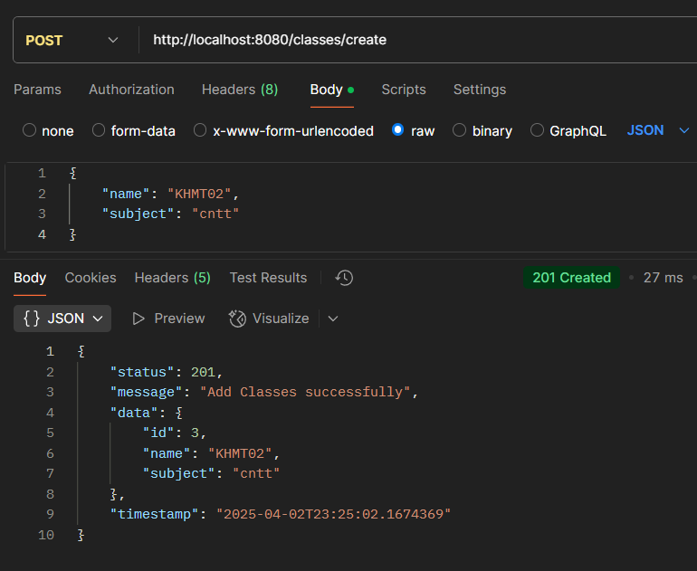

# API QUẢN LÝ SINH VIÊN

## Giới thiệu
Phần mềm Quản lý Sinh viên trong lớp học phần là một hệ thống giúp quản lý thông tin sinh viên, bao gồm các chức năng như thêm, sửa, xóa và tìm kiếm. Hệ thống được xây dựng bằng Spring Boot.

## Các API cơ bản về CRUD cho phần mềm quản lý sinh viên

### 1.1. Thêm một class mới

```shell
  cruld -X POST http://localhost:8080/v1/student/create
```
- Body:
```json
{
  "name": "KHMT01",
  "subject": "cntt"
}
```

### 1.2. Xóa class hiện có

```shell
  curl -X DELETE http://localhost:8080/classes/delete/{id}
```

- Response khi xóa thành công:
```json
{
    "status": 200,
    "message": "Delete Class successfully",
    "data": null,
    "timestamp": "2025-04-02T23:30:06.4353803"
}
```
- Response khi class muốn xóa không tồn tại:
```json
{
    "status": 404,
    "message": "Delete Class not found",
    "data": null,
    "timestamp": "2025-04-02T23:23:54.4294094"
}
```



### 2.1. Thêm student mới

```shell
    crul -X POST http://localhost:8080/v1/students/create/{className}
```

- Body:
```json
{
    "fullName": "Le Minh Hieu",
    "email": "11@gmail.com",
    "birthDay": "2005-03-28",
    "gender": "MALE",
    "phone": "11"
}
```

- Response khi thêm thành công:
```json
{
    "status": 201,
    "message": "Create Student",
    "data": {
        "id": 5,
        "fullName": "Le Minh Hieu",
        "email": "11@gmail.com",
        "phone": "11",
        "birthDay": "2005-03-28",
        "gender": "MALE",
        "classes": {
            "id": 2,
            "name": "KHMT01",
            "subject": "cntt"
        }
    },
    "timestamp": "2025-04-02T23:35:25.8421003"
}
```
### 2.1. Tìm kiếm student theo ID

```shell
  curl -X GET http://localhost:8080/v1/students/{id}
```

- Response khi student đó tồn tại:
```json
{
  "status": 200,
  "message": "Get Student Successfully",
  "data": {
    "id": 4,
    "fullName": "Le Minh Hieu",
    "email": "lminhhieu257@gmail.com",
    "phone": "0333495672",
    "birthDay": "2005-03-28",
    "gender": "MALE",
    "classes": {
      "id": 2,
      "name": "KHMT01",
      "subject": "cntt"
    }
  },
  "timestamp": "2025-04-02T23:37:42.0422822"
}
```

### 2.3. Cập nhật thông tin sinh viên

```shell
    curl -X PUT http://localhost:8080/v1/students/update/{idStudent}
```

- Body:
```json
{
    "fullName": "Le Minh Hieu",
    "email": "leminhhieu@gmail.com",
    "birthDay": "2005-03-28",
    "gender": "MALE",
    "phone": "0123456789"
}
```

- Response khi cập nhật thành công:
```json
{
    "status": 200,
    "message": "Update Student successfully",
    "data": {
        "id": 2,
        "fullName": "Le Minh Hieu",
        "email": "leminhhieu@gmail.com",
        "phone": "0123456789",
        "birthDay": "2005-03-28",
        "gender": "MALE",
        "classes": {
            "id": 2,
            "name": "KHMT01",
            "subject": "cntt"
        }
    },
    "timestamp": "2025-04-02T23:41:51.1346678"
}
```

### 2.4. Xóa student

```shell
    curl -X DELETE http://localhost:8080/v1/students/delete/{idStudent}
```

- Response trả về khi tồn tại sinh viên và xóa thành công:
```json
{
    "status": 200,
    "message": "Delete Student successfully",
    "data": null,
    "timestamp": "2025-04-02T23:43:41.0935228"
}
```
- Response trả về khi cố gắng xóa 1 student không tồn tại trong database:
```json
{
    "status": 400,
    "message": "The student does not exist",
    "data": null,
    "timestamp": "2025-04-02T23:44:22.796695"
}
```